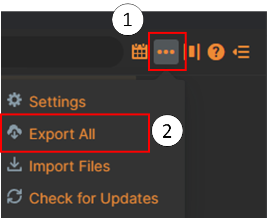

# Convert Journal from Roam to Heptabase

**Purpose**: migrate from Roam to Heptabase and have the journal files integrated into Heptabase. 

1. Export Roam ZIP file
   * 
   * Accept the default of "Markdown"
   * You will have to name the ZIP file. 
2. Extract ZIP file
   * On your machine, find the ZIP file and extract it.
3. Run convert script
   * `python convert_roam_journal_to_hepta.py -r "full-path-to-extracted-folder-above"` 
   * Note: if you want to extract just the journal files, add run argument `-p 0`
   * After running the script, verify that your journal files are named with format `YYYY-MM-DD.md`. 
4. Zip your MD files
5. Import into Heptabase
   * Import -> Obsidian ZIP
   * Select ZIP-file created above
